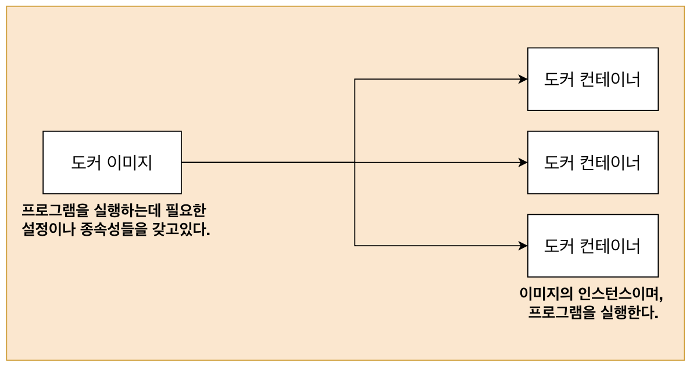
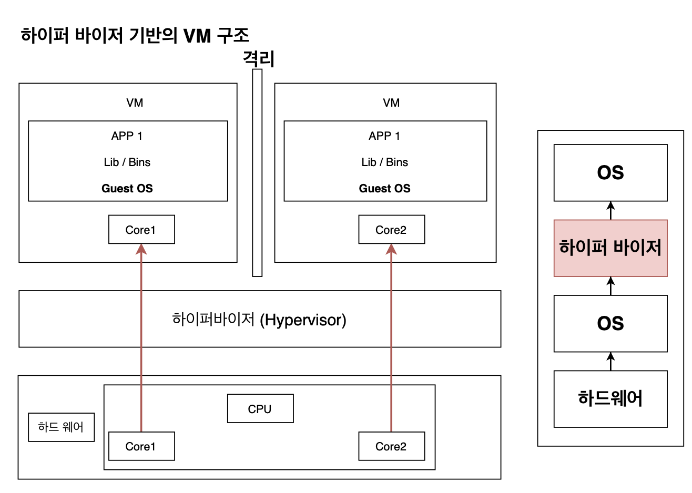
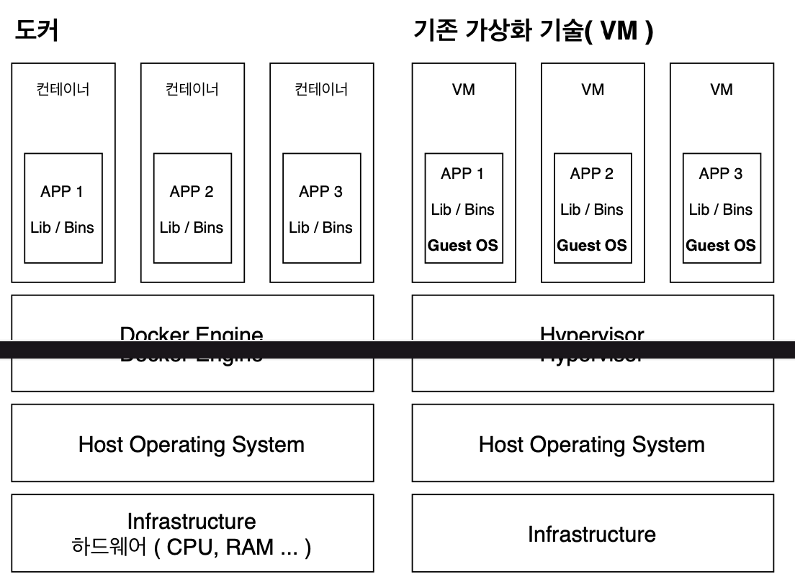

# DOCEKRCI

[전체 출처](https://github.com/jaewonhimnae/docker-codes)

# 1강 : 도커를 쓰는 이유

## 도커를 쓰는 이유는 무엇인가요 ?

우선 결론부터 얘끼하자면 어떠한 프로그램을 다운받는 과정을 굉장히 간단하게 만들기 위해서입니다.
먼저 예를 통해 이해해보자면

#### 도커 없이 프로그램을 원래 프로그램을 다운받고 실행하는 순서

Installer 다운 -> Installer 실행 -> 프로그램 설치 완료

#### 하지만....

Installer 다운 -> Installer 실행 -> 에러....

> 갖고 있는 서버, 패키지 버전, 운영 체제 등에 따라 프로그램을 설치하는 과정중에 많은 에러들이 발생하게 됨. 그것만이 아니라 설치과정이 다소 복잡함.

프로그램을 다운 받는 것을 도커 없이 방식으로 다운받을떄와
도커를 이용해서 받을떄의 차이점을 한번보자면...

### 원래 Redis 받는 과정!

Redis 홈페이지로이동 -> Redis.io

### Installation

> wget http://download.redis.io/release/redis-6.0.4.tar.gz
> tar xzf redis-6.0.4.tar.gz
> cd redis-6.0.4
> make

-> wget이 없어서 에러 발생함.

### Installation with Docker

> docker run -it redis
> 다운로드 끝

> 위에서 보는 것과 같이 도커를 이용하여 프로그램을 설치하면 예상치 못한 에러도 덜 발생하며, 설치하는 과정도 훨씬 간단해지는 것을 볼 수 있음.
> 이러한 이유로 도커를 사용하고 있음.

# 2강 : 도커란 무엇인가?

## 도커란 무엇인가요?

컨테이너를 사용하여 응용프로그램을 더 쉽게 만들고 배포하고 실행할 수 있도록 설계된 도구이며 컨테이너 기반의 오픈소스 가상화 플랫폼이며 생테계입니다.

### 그러면 컨테이너란 무엇인가여?

일반적인 컨테이너의 개념

컨테이너 : 컨테이너에 물건을 넣고 다양한 운송수단으로 쉽게 옮길 수 있음.

## 서버에서의 컨테니어 개념

-> 웹팩, 레디스 ,my sql 등이 담길 수 있음

> 이런식으로 컨테이너 안에 다양한 프로그램, 실행환경을 컨테이너로 추상화하고 동일한 인터페이스를 제공하여 프로그램의 배포 및 관리를 단순하게 해줌.
> 일반 컨테이너의 개념에서 물건을 손쉽게 운송해주는 것처럼 프로그램을 손쉽게 이동 배포 관리를 할 수 있게 해줌.
> AWS, Azure, Google Cloud 등 어디서든 실행 가능하게 해줌.

# 3강 : 도커 이미지와 도커 컨테이너 정의

## 도커 이미지와 컨테이너 정의 간단히 살펴보기

> 컨테이너는 코드와 모든 종속성을 패키지화하여 응용 프로그램이 한 컴퓨팅 환경에서 다른 컴퓨팅 환경으로 빠르고 안정적으로 실행되도록 하는 소프트웨어의 표준단위이다.

> 현재까지 여러가지 방향으로 컨테이너를 정의할 때 간단하고 편리하게 프로그램을 실행 시켜주는 것으로 정의를 내리고 있음.

> 컨테이너 이미지는 코드, 런타임, 시스템 도구, 시스템 라이브러리 및 설저과 같은 **응용 프로그램을 실행하는데 필요한 모든 것**을 포함하는 가볍고 독립적이며 실행 가능한 소프트웨어 패키지입니다.

> 또한 컨테이너 이미지는 런타임에 컨테이너가 되고 도커 컨테이너의 경우 도커 엔진에서 실행될떄 이미지 컨테이너가 된다.
> 리눅스와 윈도우 기반 애플리케이션 모두에서 사용하 수 있는 컨테이너화된 소프트웨어는 인프라에 관계없이 동일하게 실행됩니다.
> 컨테이너는 소프ㅌ웨어를 환경으로부터 격리시키고 개발과 스테이징의 차이에도 불구하고 균일하게 작동하도록 보장한다.



> 여기서는 간단하게 도커 이미지는 프로그램을 실행하는데 필요한 설정이나 종속성을 갖고 있으며 도커 이미지를 이용해서 컨테이너를 생성하며 도커 컨테이너를 이용하여 프로그램을 실행한다.

# 4강 MACOS를 위한 도커 다운받기

### 도커를 다운받느 ㄴ순서

1. docker 사이트로 이동 -> docker.com
2. get started 버튼 클릭 -> get started
3. 다운로드 도커 installer

4. 설치하기
5. Docker 사이트 회원가입
6. 도커에 로그인
7. 도커가 잘되었는지 확인(docker version)

# 5강 도커를 사용할 때의 흐름 감잡기

1. 도커 Client( CLI) -> 도커 Server(Daemon)


```shell
docker run hello-world
Unable to find image 'hello-world:latest' locally
latest: Pulling from library/hello-world
b8dfde127a29: Pull complete
//기존에 없어서 pulling 해서 가져왔음.
Digest: sha256:5122f6204b6a3596e048758cabba3c46b1c937a46b5be6225b835d091b90e46c
Status: Downloaded newer image for hello-world:latest
//실행!
Hello from Docker!
This message shows that your installation appears to be working correctly.

To generate this message, Docker took the following steps:
 1. The Docker client contacted the Docker daemon.
 2. The Docker daemon pulled the "hello-world" image from the Docker Hub.
    (amd64)
 3. The Docker daemon created a new container from that image which runs the
    executable that produces the output you are currently reading.
 4. The Docker daemon streamed that output to the Docker client, which sent it
    to your terminal.

To try something more ambitious, you can run an Ubuntu container with:
 $ docker run -it ubuntu bash

Share images, automate workflows, and more with a free Docker ID:
 https://hub.docker.com/

For more examples and ideas, visit:
 https://docs.docker.com/get-started/

```

# 6강 도커와 기존의 가상화 기술과의 차이를 통한 컨테이너 이해


> 하이퍼 바이저는 네이티브 하이퍼 바이저와 호스트형 하이퍼 바이저로 나뉘며,

> 네이티브 하이퍼 바이저의 경우, OS<-하이퍼바이저<-하드웨어 로 이루어지며, 하이퍼 바이저가 하드웨어를 직접 제어하기에 자원 효율적으로 사용 가능하며, 별도의 호스트 OS가 없으므로 오베헤드가 적다. 하지만 여러 하드웨어 드라이버를 세팅해야 하므로 설치가 어렵다.

> 호스트형 하이퍼 바이저의 경우, OS <- 하이퍼 바이저 <-OS <- 하드웨어로 구성되며, 일반적인 소프트웨어 처럼 호스트 OS 위에서 실행되며, 하드웨어 자원을 VM 내부의 게스트 OS에 에뮬레이트(모방하다)하는 방식으로 오버헤드가 크다. 하지만 게스트 OS 종류에 대한 제약이 없고 구현이 다소 쉽다. 일반적으로 많이 이용하는 방법!



> 하드웨어의 core와 os가 분리되어 연결되어 있으며, 하이퍼바이저에 의해 구동되는 VM은 각 VM마다 독립된 가상 하드웨어 자원을 할당받음. 논리적으로 분리되어 있어서 한 VM에 오류가 발생해도 다른 VM으로 퍼지지 않는다는 장점이 있음.



> VM과 비교했을 때 컨테이너는 하이퍼바이저와 게스트 OS가 필요하지 않으므로 더 가볍습니다.

> 어플리케이션을 실행할 떄는 컨테이너 방식에서는 호스트 OS위에 어플리케이션의 실행 패이지인 이미지를 배포하기만 하면 된느데

> VM은 어플리케이션을 실행하기 위해서 VM을 띄우고 자원을 할당한 다음, 게스트 OS를 부팅하여 어플리케이션을 실행하도록 하여 훨씬 복잡하고 무겁게 실행해야 합니다.

### 도커 Vs 기존 가상화 기술(VM)

#### 공통점

도커 컨테이너와 가상 머신은 기본 하드웨어에서 격리된 환경 내에 애플리케이션을 배치하는 방법임.

#### 차이점

가장 큰 차이점은 격리된 환경을 얼마나 격리를 시키는지의 차이

> **도커 컨테이너**에서 돌아가는 애플리케이션은 컨테이너가 제공하는 격리 기능 내부에 샌드박스가 있지만, 여전히 같은 호스트의 다른 컨테이너의 동일한 커널을 공유한다. 결과적으로, 컨테이너 내부에서 실행되는 프로세스는 호스트 시스템(모든 프로세스를 나영할 수 있는 충분한 권한있음)에서 볼 수 있다.
> 예를 들어, 도커와 함께 몽고 DB 컨테이너를 시작하면 호스트의 일반 쉘에 ps-e grep 몽고를 실행하면 프로세스가 표시됨.
> 또한 컨테이너가 전체 OS를 내장할 필요가 없는 결과, 그것들은 매우 가볍고, 일반적으로 약 5-100MB이다.

> **가상 머신**과 함께 VM 내부에서 실행된느 모든 것은 호스트 운영체제 또는 파이퍼바이저와 독립되어 있다. 가상 머신 플랫폼은 특정 VM에 대한 가상화 프로세스를 관리하기 위해 프로세스를 시작하고, 호스트 시스템은 그것의 하드웨어 자원의 일부를 VM에 할당한다. 그러나 VM과 근본적으로 다른 것은 시작 시간에 이 VM 환경을 위해 새롭고 이 특정 VM만을 위한 커널을 부팅하고(흔히 다소 큰) 운영체제 프로세스 세트를 시작한다는 것이다. 이것은 응용 프로그램만 포함하는 일반적인 컨테이너보다 VM의 크기를 훨씬 크게 만든다. OS까지 가상화... 맥에서 윈도우를 깐다든지 리눅스에서 윈도우를 돌린다든지... 이러한 방법은 비교적 사용법이 간단할 수 있지만 굉장히 느리다.


> 프로세스간에도 커널이 공유되어 있으나, 컨테이너간에는 격리가 되어 있다. 하드디스크에서도 격리되어 있따.

### 어떻게 도커컨테이너를 격리를 시킬까?

먼저 리눅스에서 쓰는 Cgroup(Control groups)와 네임스페이스(namespace)에 대해서 알아야 함.

이것들은 컨테이너와 호스트에서 실행되는 다른 프로세스 사이에 벽을 만드는 리눅스 커널 기능들임.

### C Group

> CPU, 메모리, Network Bandwidth, HW I/O 등 프로세스 그룹의 시스템 리소스 사용량을 관리
> -> 어떤 어플이 사용량이 너무 많다면 그 어플레이션 가은 것을 c group에 딥어넣어 cpu와 메모리 사용 제한 간으

#### 네임스페이스

> 하나의 시스템에서 프로세스를 격리시킬 수 있는 가상화 기술
> 별개의 독립된 공간을 사용하는 것처럼 격리된 환경을 제공하는 경량 프로세스 가상화 기술

# 8강 이미지로 컨테이너 만들기

## 시작하기 전에 기억해야 할 것

이미지는 응용 프로그램을 실행하는데 필요한 모든 것을 포함하고 있음.

## 그러면 필욯나 것이 무엇일까요?

1. 컨테이너 시작될 떄 실행된느 명령어 ex) run kakaotalk
2. 파일 스냅샷 ex) 컨테이너에서 카카오톡을 실행하고 싶다면 카카오톡 파일 스냅샷

- 파일 스냅샷은 디렉토리나 파일을 카피한 것

### 이미지로 컨테이너를 만드는 순서

1. 도커 클라이언트에 docker run <이미지>를 입력해줍니다.
2. 도커 이미지에 있는 파일 스탭샷을 컨테이너 하드 디스크에 옮겨 줍니다.


3. 이미지에서 가지고 있는 명령어 (컨테이너가 실행될 떄 사용될 명령어)를 이용해 서 카카오톡을 실행시켜 줍니다.

# 9강 C-group, 네임스페이스를 도커 환경에서 쓸 수 있는 이유

컨테이너를 격리시킬 수 있는 이유는 cgroup과 네임스페이스를 이용해서이다.
하지만 생각해보면 cgroup과 네임스페이스는 리눅스 환경에서 사용되어지는 것인데....


하지만 cgroup과 네임스페이스는 리눅스에서만 가능

하지만 우리는 맥이나 윈도우를 사용하고 있는 것이 현실임...


# 1강 완료!

---
