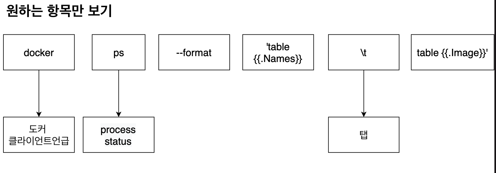
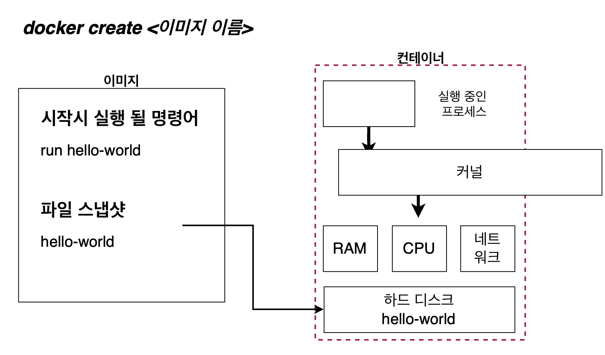

# 2- 1강 도커 이미지 내부 파일 구조 보기

## 기본적인 도커 클라이언트 명령어 알아보기


### 작동 순서 복습

1. 도커 클라이언트에 명령어 입력 후 도커 서버로 보냄
2. 도커 서버에서 컨테이너를 위한 이미지가 이미 캐쉬가(캐시에 저장되어 있는지) 되어 있는지 확인
3. 없으면 도커 허브에서 다운받아옴 있다면 이미 가지고 있는 이미지로 컨테이너 생성

### 이미지로 컨테이너 생성하는 순서 복습

1. 먼저 파일 스냅샷 되있는 것을 컨테이너의 하드 디스크 부분에 올린다.
2. 시작 커맨드를 이용하여 어플리케이션을 실행한다.

### 어떻게 Alpine 이미지를 이용해 ls 명령어를 실행가능?

1. Alpine 이미지를 이용해서 컨테이너를 생성.
2. 생성할 떄 Alpine 이미지 안에 들어있던 파일 스냅샷들(bin, dev, etc 등등)이 컨테이너 안에 있는 하드 디스크로 다운로드됨.
3. 이미지 이름뒤에 다른 명령어를 더 붙여서 원래 이미지 안에 들어있는 기본 커맨드는 무시가 되고 ls 명령어가 실행됨

```shell
Status: Downloaded newer image for alpine:latest
bin
dev
etc
home
lib
media
mnt
opt
proc
root
run
sbin
srv
sys
tmp
usr
var
```

하지만 어떻게 Alpine 이미지를 이용해 ls 명령어를 실행가능?

1. Alpine 이미지 파일 스냅샷안에 이미 ls를 사용 가능하게 하는 파일이 있음.

hello-world 이미지로는 ls 명령어를 사용 불가능

1. docker run hello-world ls 하면 오류가 뜸.
   (executable file not found.)


# 3강 컨테이너들 나열하기


### 실습

1. 2개의 터미널을 작동시킴.
2. 첫번쨰의 터미널에서 컨테이너 하나를 실행
   (하지만 이때 컨테이너를 바로 켰다가 바로 끄며
   3번을 할 때 이미 프로세스가 꺼져있이 때문에 리스트에서 볼 수 없다.)
3. 그리고 두번째 Terminal에서 docer ps로 확인
4. 그러면 꺼져있는 container도 확인하고 싶다면?

'''shell
CONTAINER ID IMAGE COMMAND CREATED STATUS PORTS NAMES
0d863e4c7133 alpine "ping localhost" 11 seconds ago Up 10 seconds vigilant_solomon
'''

| 구성 요소    | 역할                                                                                                                                                                                                                                              |
| ------------ | ------------------------------------------------------------------------------------------------------------------------------------------------------------------------------------------------------------------------------------------------- |
| Container ID | 컨테이너의 고유한 아이디 해쉬값. 실제로는 더욱 길지만 일부부만 표출.                                                                                                                                                                              |
| Image        | 컨테이너 생성시 사용한 도커 이미지                                                                                                                                                                                                                |
| Command      | 컨테이너 시작시 실행될 명령어. 대부분 이미지에 내장되어 있으므로 별도 선정이 필요 없음                                                                                                                                                            |
| Created      | 컨테이너가 생성된 시간                                                                                                                                                                                                                            |
| STATUS       | 컨테이너의 상태, 실행중으 Up, 종류중은 Excited, 일시정지 Pause                                                                                                                                                                                    |
| Ports        | 컨테이너가 개방한 포트와 호스트에 연결한 포트. 특별한 설정을 하지 않은 경우 출력되지 않음. 뒤에 가서 자세히 ㄹ설명                                                                                                                                |
| Names        | 컨테이너 고유한 이름, 컨테이너 생성시 --name 옵션으로 이름을 설정하지 않으면 도커 엔진이 임의로 형용사와 명사를 조합해 설정. id와 마찬가지로 중복이 안되고 docekr rename 명령어로 이름을 변경할 수 있음. docker rename original-name changed-name |

> 아래와 같이 원하는 부분만 볼수도 있다.

```shell
docker ps --format 'table{{.Names}}\table{{.Image}}'
NAMES               ableIMAGE
peaceful_goldberg   ablealpine
```

> 모든 컨테이너 나열

```shell
docker ps -a
```




# 4강 도커 컨테이너의 생명주기


생성부터 삭제까지!를 보여주는 것이 생명주기임.

1. docker create
2. docker start
3. docker run
4. docker stop
5. docker rm

> docker run<이밎 이름>으로 컨테이너 생성 실행했는데 이걸 docker create와 docker start으로 쪼개서 볼 수 있음.




> 여기서 docker start -a <컨테이너 아이디/이름> 해야 하며, 아이디는 7자리만 해도 된다.


### 어떤 차이가 있을까?

공통점은 둘다 실행중인 컨테이너를 중지시킴.

하지만

1. **Stop**은 Gracefully하게 중지를 시킴.
   자비롭게 그동안 하던 작업들을(메시지를 보내고 있었다면 보내고 있던 메시지) 와뇰하고 컨테이너를 중지시킴.

2. **Kill** 같은 경우는 Stop과 달리 어떠한 것도 기다리지 않고 바로 컨테이너를 중지시킴.


# 4강 컨테이너 삭제하기


# 5강 실행중인 컨테이너에 명령어 전달

## 이미 실행중인 컨테이너에 명령어를 전달하고 싶다면?

## docker exec <컨테이너 아이디>

1. 먼저 터미널 2개를 실행합니다.
2. 첫번쨰 터미널에서 컨테이너 하나를 실행합니다.(docker run alpine pign localhost)
3. 두번쨰 터미널에서 컨테이너가 잘 작도아고 있는지 확인하고 다른 명령어를 전달합니다.

```shell
docekr exec <컨테이너 아이디> ls
```


> 똑같은 결과를 내주는 것! docker run <이미지 이름> ls

# 6강 레디스를 이용한 컨테이너 이해

> 레디스를 도커 환경에서 실행을 해서 컨테이너를 더욱 이해해보는 시간을 갖겠음.
> 그러기 위해서 레디스를 실행을 해야함.
> 그 전에 레디스를 어떻게 이용하며 작동하는지 알아보겠음.


> 위에 도표와 같이 먼저 레디스 서버를 실행한 후, 레디스 클라이언트를 통해서 서버에 명령어를 전달해 줘야 함.

1. 먼저 첫번째 터미널을 실행 후, 레디스 서버를 작동시키자.

```
docker run redis
```

2. 그 후 레디스 클라이언트를 켜야 하는데 첫번째 터미널에서는 아무것도 할 수 없다. 그러니 두번째 터미널을 켜서 레디스 클라이언트를 작동시킨다.

```
redis-cli
```

3. 하지만 에러가 났다. 무엇이 잘못됬을까?

-> 레디스 클라이언트가 레디스 서버가 있는 컨테이너 밖에서 실행을 하려 하니 레디스 서버에 접근을 할 수가 없기에 레디스 클라이언트를 작동하려 할 때 에러가 발생함. 레디스 서버가 동작중이라서 들어갈수가 없다.

1. 먼저 이전과 똑같이 첫번쨰 터미널을 킨 후, 레디스 서버를 작동시키자.

```
docker run redis
```

2. exec를 써먹어서 이미 실행중인 컨테이너에 명령어를 전달할 때 exec를 쓴다고 배웠음.
   exec를 활용하여 redis 클라이언트 실행 가능!

```
docker exec -it <컨테이너 아이디> redis-cli
```

### ? 여기서 왜 -it를 넣는가?

> -it가 없다면 이렇게 그냥 redis-cli를 키기만 하고 밖으로 다시 나와버린다. iterative terminal


# 7강 실행중인 컨테이너에서 터미널 생활 즐기기

> 지금까지 실행중인 컨테이너에 명령어를 전달할때에는

> 명령어를 하나 입력해야 할 때마다 이 모든 것을 입려해줬어야 했다.

> 이러한 문제점을 해결해주기 위해 컨테이너 안에 쉘이나 터미널 환경으로 접속을 해줄수가 있음.

### 컨테이너를 쉘 환경으로 접근해보기

1. 먼저 첫번쨰 터미널을 실행한 후, alpine 이미지를 이용해서 컨테이너를 실행합니다.
   docker run alpine ping localhost

2. 그 후 exec을 이용하고 마지막 명령어 부분에 sh 를 입력후 컨테이너 안에서 터미널 환경ㅇ르 구축
   docker exec -it 컨테이너 아이디 sh

3. 그 안에서 여러가지 터미널에서 원래할 수 있는 작동들을 해봅니다.

- ls 컨테이너 디렉토리에 있는 내용 확인
- touch new-file 파일 생성
- export hello=hi 변수 생성 출력
