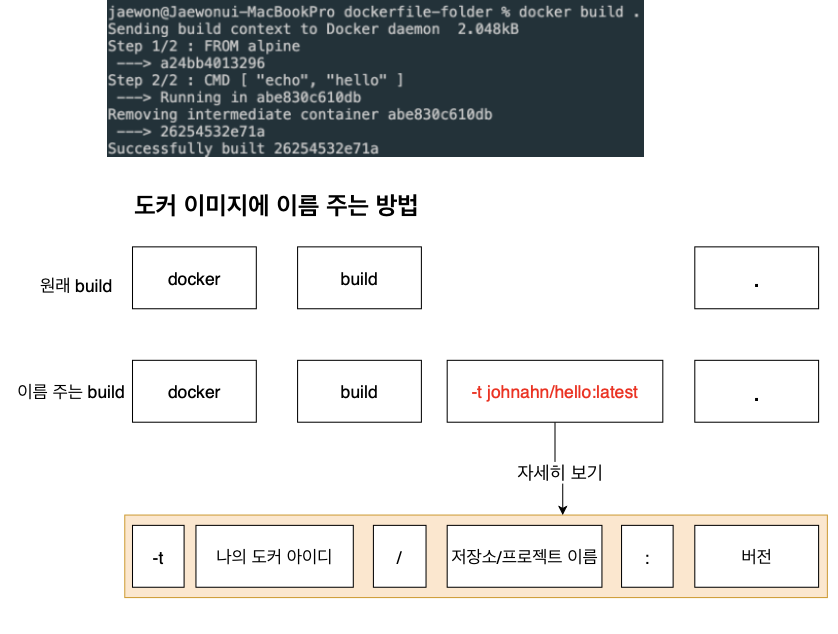

# 3강좌 스타트

# 1강 도커 이미지 생성하는 순서

> 현재까지는 도커 이미지를 항상 도커 허브에 이미 있던것들만 가져와서 사용했음. 하지만 저희가 직접 도커 이미지를 만들어서 사용할수도 있고 직접 만든 도커 이미지를 도커 허브에 올려서 공유할수도 있음.

> 이번에는 직접이미지를 만들어보도록 함

### 도커의 특징

1. 도커 이미지는 컨테이너를 만들기 위해 필요한 설정이나 종속성들을 갖고있는 소프트웨어 패키지임.
2. 지금까지 해왔듯이 도커 이미지는 Dockerhub에 이미 다른 사람들이 만들어 놓은 것을 이용할 수도 있으며, 직접 도커 이미지를 만들어서 사용할수도 있고 직접 만든것을 Dockerhub에 업로드할 수도 있음.


# 2강 Dockerfile 만들기

## 도커 파일이란?

- 도커 이미지를 만들기 위한 설정 파일이며, 컨테이너가 어떻게 행동해야 하는지에 대한 설정들을 정의해 주는 곳입니다.

## 도커 파일 만드는 순서 (도커 이미지가 필요한 것이 무엇인지를 생각하기)

1. 베이스 이미지를 명시해준다. (파일 스냅샷에 해당)
2. 추가적으로 필요한 파일을 다운받기 위한 몇가지 명령어를 명시해준다. (파일 스냅샷에 해당)

3. 컨테이너 시작시 실핼될 명령어를 명시해준다. (시작시 실행될 명령어에 해당)

> 베이스 이미지란? : 도커 이미지는 여러개의 레이어로 되어 있다. 그 중에서 베이스 이미지는 이 이미지의 기반이 되는 부분이다. 레이어는 중간 단계의 이미지라고 생각하면 됨.

> 만약 이 이미지에 무엇인가 추가한다면? 아래 보이는 레이어가 추가된다. (레이어 캐싱)

## 결론

이미지 안에 베이스 이미지가 기저에 깔리고, 그 위에 레이어가 캐싱되며 레이어가 쌓이게 된다.!
베이스 이미지는 OS라고 생각하면 됨.


### 실제로 만들어보기

목표는 "hello 문구" 출력하기

1. 도커 파일을 만들 폴더 하나 만들기 ex) dockerfile - folder
2. 방금 생성한 도커 파일 폴더를 에디터를 이용해서 실행
3. 파일 하나를 생성, 이름은 dockerfile
4. 그 안에 먼저 어떻게 진행해 나갈지 기본적인 토대를 명시

```docker
# 베이스 이미지를 명시해준다.

FROM baseImage

# 추가적으로 필요한 파일들을 다운로드 받는다.

RUN command

# 컨테이너 시작시 실핼될 명령어를 명시해준다.
CMD ["executable"]
```

5. 이제 베이스 이미지부터 실제값으로 추가해주기.
6. 베이스 이미지는 우분투를 써도 되고 centos를 써도 되지만
   hello를 출력하는 기능은 굳이 사이즈가 큰 베이스 이미지를 쓸 필요가 없기에 사이즈가 작은 alpine 베이스 이미지를 사용
7. hello 문자를 출력해주기 위해 echo를 사용하여야 하는데 이미 alpine 안에
   Echo를 사용하게 할 수 있는 파일이 있기에 RUN 부분은 생략함.
8. 마지막으로 컨테이너 시작시 실행될 명령어 echo hello를 적어준다.

```docker
# 베이스 이미지를 명시해준다.
FROM alpine

# 추가적으로 필요한 파일들을 다운로드 받는다.
#RUN command

# 컨테이너 시작시 실핼될 명령어를 명시해준다.
CMD ["echo", "hello"]

```

### FROM RUN CMD 등은 도커 서버에게 무엇을 하라고 알려준다.

##### FROM

: 이미지 생성시 기반이 되는 이미지 레이어임.
<이미지 이름><태그> 형식으로 작성
태그를 안붙이면 자동적으로 가장 최신것으로 다운 받음
ex) ubuntu: 14.04

##### RUN

도커 이미지가 생성되기 전에 수행할 쉘 명령어

#### CMD

컨테이너가 시작되었을 때 실행할 실행 파일 또는 쉘 스크립트임.
해당 명령어는 DockerFile내 1회만 쓸 수 있음.

# 3강 도커 파일로 도커 이미지 만들기

도커 파일에 입력된 것들이 도커 클라이엍느에 전달되어서 도커 서버가 인식하게 하여야 합니다.
그렇게 하기 위해서 docker build ./ 또는 docker build .

### build 명령어는

- 해당 디렉토리 내에서 dockerfile이라는 파일을 찾아서 도커 클라이언트에 전달시켜준다.

- docker build 뒤에 ./와 .는 둘다 현재 디렉토리를 가르키다.

그래서 docker buid .를 해보면


### 결론

- 베이스 이미지에서 다른 종속성이나 새로운 커맨드를 추가할 때는 임시 컨테이너를 만든 후 그 컨테이너를 토대로 새로운 이미지를 만든다.
  그리고 그 임시 컨테이너는 지워준다.



# 4강 내가 만든 이미지 기억하기 쉬운 이름 주기

```
docker run -it 66a8750
```

> 위와 같이 넣어줄 수가 없다!
> 기억하기 쉬운 이름을 줘야한다.

```
docker build -t moons94/hello:latest
./
```

```
docker build -t moons94/hello:latest ./

 => => naming to docker.io/moons94/hello:latest


docker run -it moons94/hello
hello
```
