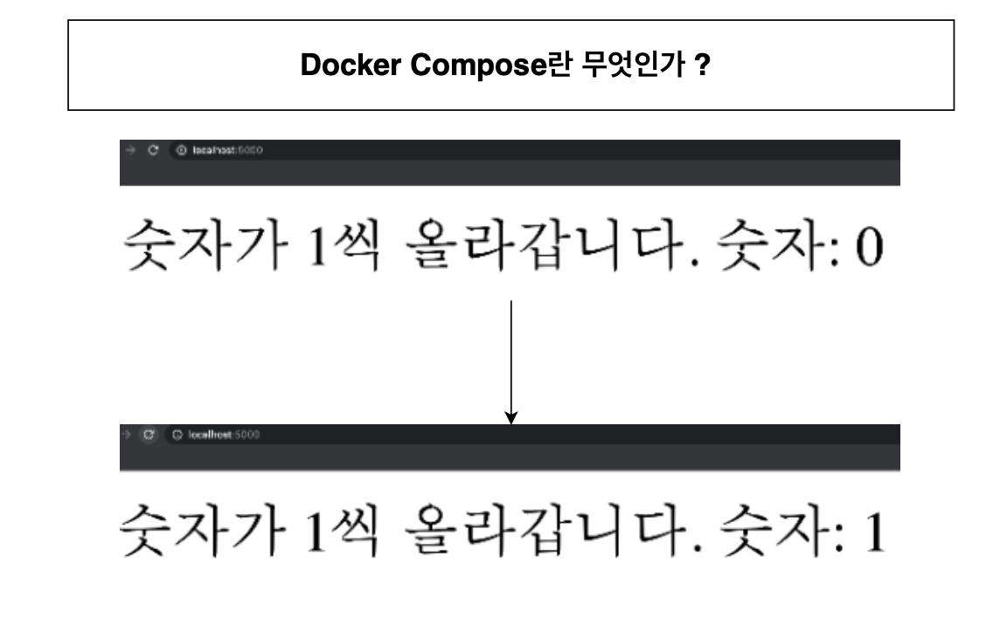
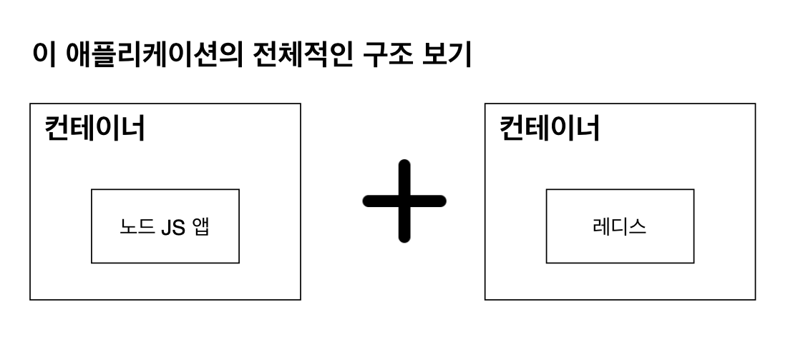
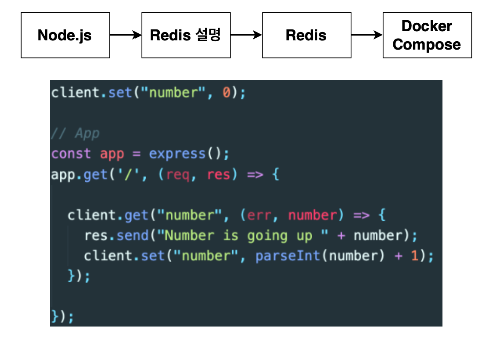
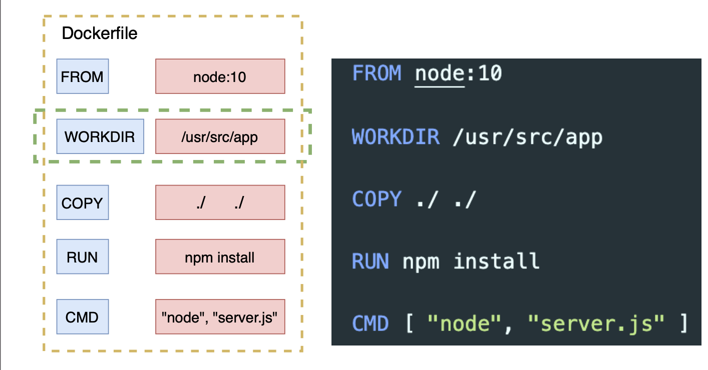
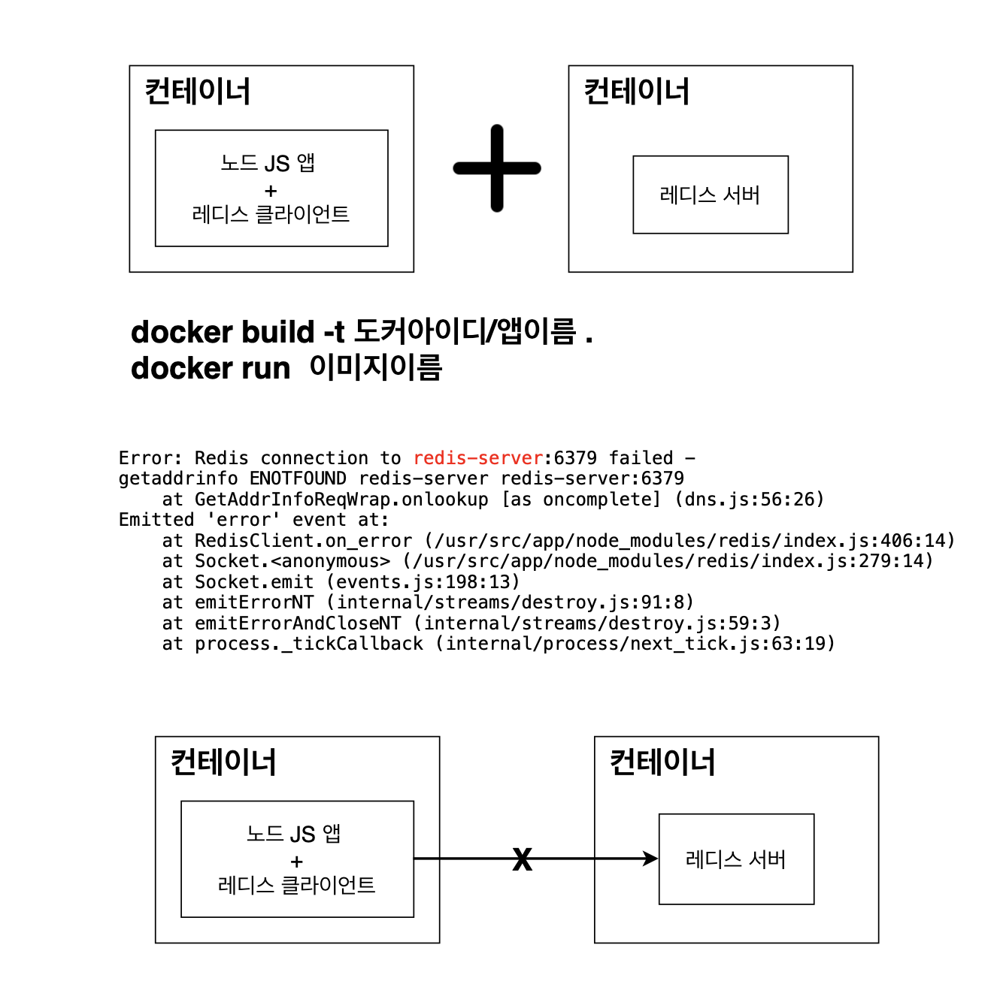
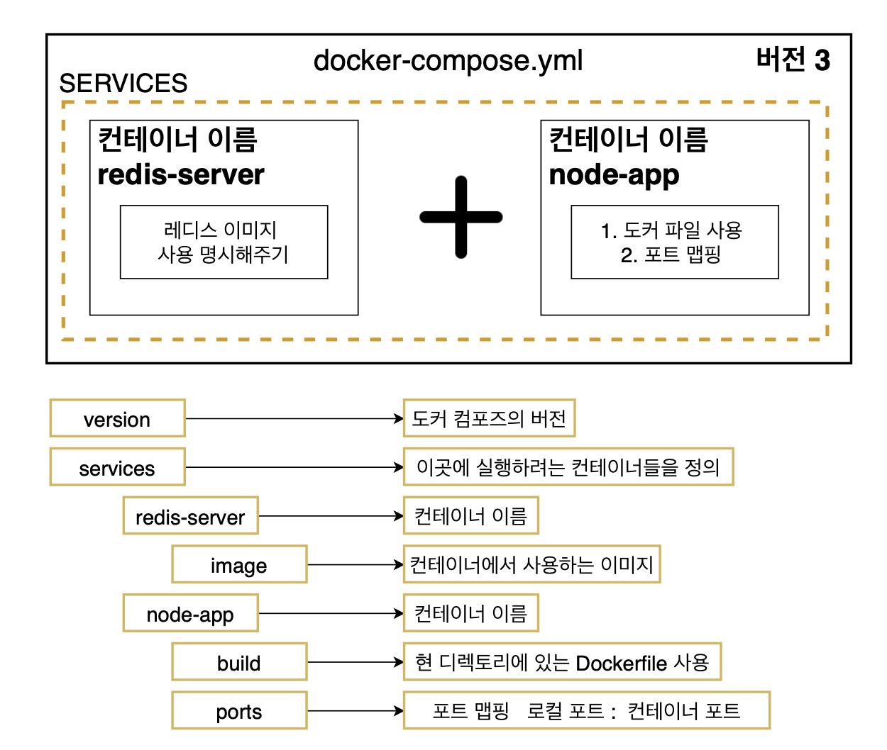

# 1강 Docker Compose란 무엇인가?

### Docker Compose

: 다중 컨테이너 도커 애플리케이션을 정의하고 실행하기 위한 도구임.

Docker Compose 소개



어플리케이션은 위와 같이 구성됨

# 2강 어플리케이션 소스 작성하기

1. 새로운 프로젝트를 만들 새로운 폴더를 하나 설정함!

2. package.json -> npm init, server.js
3. 기본적인 노드 부분 완성하기
4. 레디스 부분 완성하기
5. 그전에 간단하게 Redis 설명!

#### 레디스란?

Redis(Remote Dictionary Server)는 메모리 기반의 키-값 구조 데이터 관리 시스템이며, 모든 데이터를 메모리에 저장하고 빠르게 조회할 수 있는 비관계형 데이터베이스이다.

#### 레디스를 쓰는 이유?

메모리에 저장을 하기 때문에 MySQL같은 데이터베이스에 데이터를 저장하는 것과 데이터를 불러올때 훨씬 빠르게 처리할 수가 있으며, 비록 메모리에 저장하지만 영속적으로도 보관이 가능하다.
그래서 서버를 재부팅해도 데이터를 유지할 수 있는 장점이 있다.

#### Node.js 환경에서 Redis 사용 방법

- 먼저 redis-server를 작동시켜주어야 함.
- 그리고 redis 모듈을 다운받음.
- 레디스 모듈을 받은 후 레디스 클라이언트를 생성하기 위해서 Redis에서 제공하는 createClient() 함수를 이용해서 redis.createClient로 레디스 클라이언트를 생성해준다.
- 하지만 여기서 redis server가 작동한느 곳과 node.js앱이 작동하는 곳이 다른곳이라면 host인자와 port 인자를 명시해주어야 한다.

```js
const client = redis.createClient({
  host: "https://redis-server.com",
  port: 6379,
});
```

- 만약 Redis 서버가 작동하는 곳이 redis-server.com이라면 Host 옵션을 위에 철머 주면 된다.

#### 도커 환경에서 레디스 클라이언트 생성시 주의사항

- 보통 도커를 사용하지 않는 환경에서는 Redis 서버가 작동되고 있는 곳의 host 옵션을 URL로 위에 처럼 주면 되지만, 도커 Compose를 사용할 떄는 host 옵션을 docker-compose.yml 파일에 명시한 컨테이너 이름으로 주면된다.

```js
const client = redis.createClient({
  host: "redis-server",
  port: 6379,
});
```

#### 실제로 노드 앱에 레디스로 간단한 기능 구현하기(리프레쉬 마다 1씩 올라가는 기능!)



# 3강 DockerFile 작성하기



# 4강 Docker Containers간 통신할 떄 나타나는 에러



> 서로 다른 컨테이너에 있는데 이렇게 컨테이너 사이에는 아무런 설정없이는 접근을 할 수 없기에 노드 JS 앱에서 레디스 서버에 접근을 할 수 없음.

```
docker run redis
```

- 먼저 레디스 클라이언트가 작동하려면 레디스 서버가 켜져있어야 하기 때문에 먼저 레디스 서버를 위한 컨테이너를 실행하고 노드 js를 위한 컨테이너를 실행하겠음.

```docker build 도커아이디/앱이름 .
docker run -p 5000:8080 이미지 이름
```

- 그런데 레디스 서버스를 위한 컨테이너를 실행하고 노드 js를 위한 컨테이너를 실행할떄 위와 같이 에러가 나타남.

##### 어떻게 컨테이너 사이에 통신을 할 수 있게 해줄까요?

그래서 Docker Compose가 필요한 것이다!!

# 5강 Docker Compose 파일 작성하기

> Docker Compose 파일을 yaml 파일인데 yml이 무엇일까? YAML( ain't markup language의 약자이며) 일반적으로 구성 파일 및 데이터가 저장되거나 전송되는 응용 프로그램에서 사용되고 원래는 XML이나 json 포맷으로 많이 쓰였지만, 좀더 사람이 읽기 쉬운 포맷으로 나타난게 yaml



```
version: "3"
services:
  redis-server:
    image: "redis"
  node-app:
    build:
    ports:
      - "5000:8000"

```

> 이렇게 도커 컴포즈를 다 작성한 후 도커 컴포즈를 이용해서 앱을 실행할 때 쓰는 명령어는

```
docker-compose up
```

# 6강 Docker Compose로 컨테이너를 멈추기

- 도커 컴포즈를 통해 작동시킨 컨테이너들을 한꺼번에 중단시키려면

docker compose down 으로 할 수 있음.

실제로 한번 해보면
docker composer up --build

docker-compose up : 이미지가 없을떄 이미지를 빌드하고 컨테이너에 시작

docker-compose up --build : 이미지가 있든 없든 이미지를 빌드하고 컨테이너에 시작

다른 터미널은 켜서
docker-compose down

docker compose를 컨테이너에 실행할 때

docker-compose up -> docker-compose up -d

-d :detached 모드로서 앱을 백그라운드에서 실행시킨다. 그래서 앱에서 나오는 output을 표출하지 않는다.

> 그렇게 앱을 실행한다면 하나의 터미널에서 앱을 작동시키고 중단시킬 수 있다.
