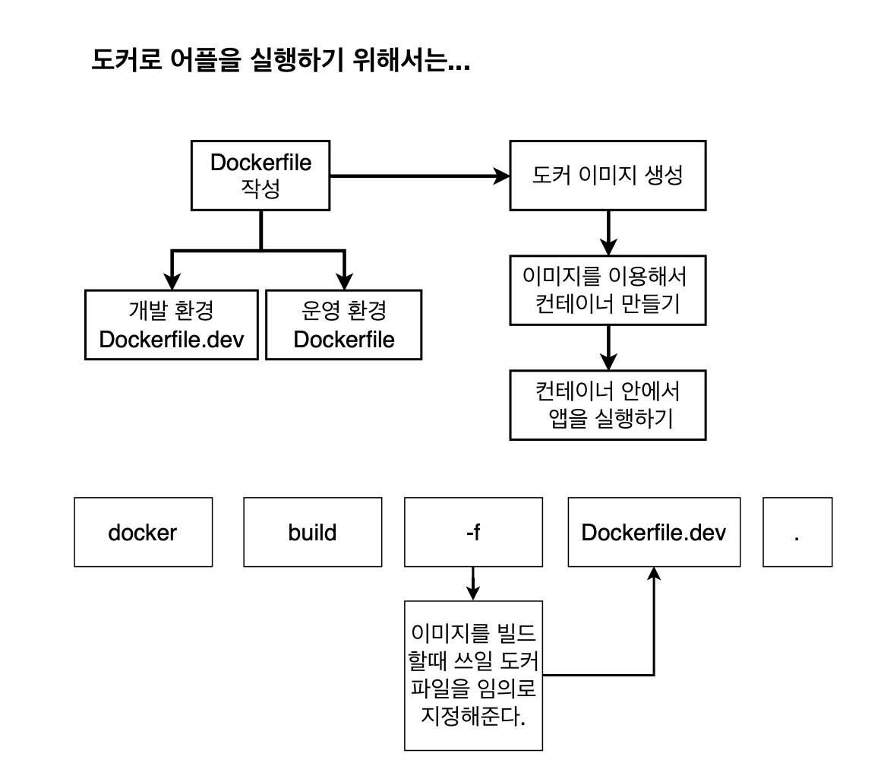
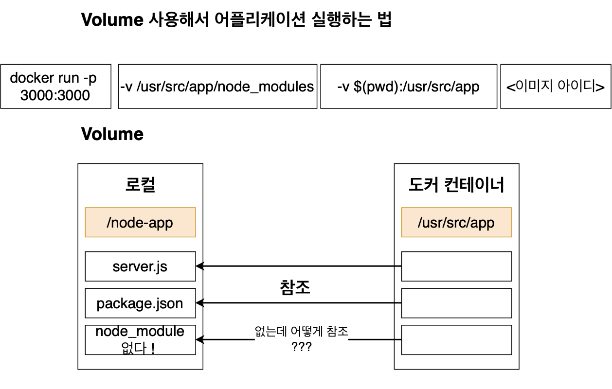

# 개발 환경에서 리액트앱 개발

# 1강 섹션 설명


# 2강 리액트 앱 설치하기


```
npx create-react-app ./
```

1. 개발단계 이렇게만 하면 설치가 다 된것임. 실행은 npm run start를 입력하면 됨

2. 테스트 단계 : 개발이 완료되었다면 개발한 것에 문제가 있는지 없는지 테스트를 해볼 수 있음. 테스트는 아래 명령어로 할 수 있음.

3. 배포 단계(build) : 이렇게 테스트까지 완성이 된다면 이제는 배포를 해서 다른 사람들도 이용할 수 있도록 배포를 위한 폴더와 파일들ㅇ르 생성해야 함. 생성하기 위해서는 npm run build로 입력하면 됨.

> 이렇게 배포를 위한 명령어까지 작성하면 배포를 할때 사용할 수 있는 build폴더와 그안에 많은 파일들이생성이 됨.

# 3강 도커를 이용하여 (개발단계에서) 리액트 앱 실행하기



> 현재까지는 Dockerfile을 그냥 한 가지만 만들었지만 실제로는 Dockerfile을 개발단계를 위한 것과 실제 배포 후를 위한 것을 따로 작성하는 게 좋음.
> 그러므로 개발단계를 위해서 Dockerfile일 아닌 Dockerfile.dev라는 파일을 작성해보겠음.


1. docker build ./

> **unable to evaluate symlink...** 이러한 에러가 보임. 그 이유는 원래 이미지를 빌드할 때 해당 디렉토리만 정해주면 dockerfile을 자동으로 찾아서 빌드하는데 현재는 dockerfile이 없고 dockerfile.dev밖에 없음.
> 그러기에 자동으로 올바른 도커 파일을 찾지 못하여 이런 에러가 발생함.
> 해결책은 임의로 build 할 때 어떠한 파일을 참조할 지 알려준다.

docker build -f Dockefile.dev ./
(이미지를 빌들할때 쓰일 도커 파일을 임의로 지정해준다.)

> 리액트 앱을 실행할 때 필요한 모듈들이 들어있는 node_modules가 있지만 굳이 로컬 머신에서는 필요없기 떄무에 지워주면 좋다.

# 4강 생성된 도커 이미지로 리액트 앱 실행해보기

docker build -f Dockerfile.dev -t moons94/docekr-react-app ./

docker run moons94/docker-react-app:latest

> 실행되지 않는 이유는? 예저에 했던 것과 같이 포트 매핑을 해줘야 하는데 안해줬기 때문에 컨테이너 안에서 실행되고 있는 리액트 앱에 도달하지 못했따.
> 

ocker run -it -p 3000:3000 moons94/docker-react-app

아주 잘되는 것을 확인할 수 있음!

# 5강 도커 볼륨을 이용한 소스 코드 변경

> 이미 COPY 대신 VOLUME을 이용하므로 소스를 변경했을 댸 다시 이미지를 빌드하지 않아도 변경한 소스 부분이 어플리케이션에 반영되는 부분을 해보았음. 그래서 리액트 앱에서도 그 부분을 적용할 수 있음



docker run -it -p 3000:3000 -v /usr/src/app/node_modules -v $(pwd):/usr/src/app moons94/docker-react-app

> volume까지 설정했다면 이제는 소스를 변경해서 바로 변경된 것이 반영이 되는지를 확인!

# 6강 도커 컴포즈로 더 간단하게 앱 실행해보기

앞서 적용했던 커맨드가 너무 길다는 것을 알 수있다. 그렇기 때문에 Docker Compose 파일을 작성해서 보다 간단하게 만들어낼 수 있따.

1. 먼저 docker-compose.yml 파일 생성
2. docker-compose.yml 파일 작성하기


# 7강 리액트 앱 테스트하기

일반적으로 테스트는 npm run test로 하지만

도커를 이용한 리액트 앱에서 테스트를 진행하려면...


> 테스트 성공한 것 확인하였음.

> 테스트도 소스 코드 변경하면 자동으로 반영되는 것처럼 테스트 소스도 추가하면 바로 반영되었으면 좋게다 하는 방법은? 소스 코드 변경을 위해서 volume을 이용하듯이 이번에도 volume을 이용하지만 test를 위한 컨테이너를 compose 파일에 하나더 만들어 주면 됨.

# 8강 운영환경을 위한 Nginx

> 이제는 운영환경(배포 후)을 하나하나 다뤄보기로 함.
> 먼저 Nginx를 살펴보도록 함.

### Nginx는 무엇이고 왜 필요한가?

개발 환경에서는 리액트 컨테이너에 개발 서버가 전반적인 것을 컨트롤 하나,
운영 환경에서는 개발 서버가 없다.
그에 맞게 정적 파일을제공해줘야 한다.
NGinx가 필요한 이유!


### 왜 개발 환경 서버와 운영환경 서버를 다른 것을 써야할까요?

개발 에서 사용한느 서버는 소스를 변경하면 자동으로 전체 앱을 다시 빌드해서 변경 소스를 반영해주는 것 같이 개발 환경에 특화된 기능들이 있기에 그러한 기능이 없는 Nginx 서버보다 더욱 적합함.
그리고 운영환경에서는 소스를 변경할 때 다시 반영해줄 필요가 없으며, 개발에 필요한 기능들이 필요하지 않기에 더 깔끔하고 빠른 Nginx를 웹서버로 사용가능함.

# 9강 운영환경 도커 이미지를 위한 Dockerfile 작성하기

### Nginx를 포함하는 리액트 운영환경 이미지를 생성해보도록 함!

이미지를 생성하기 위해서 Dockerfile을 작성함.

리액트 개발환경에서 필요한 이미지를 생성하기 위해서는 Dockerfile.dev

리액트 운영환경에서 필요한 이미지를 생성하기 위해서는 Dockerfile


개발 환경과 운영환경의 도커파이 차이점은 개발 환경에서는 build를 할 필요없이 실행이 가능하지만 운영 환경에서는 build를 해줘야 하므로
CMD에 npm run build로 빌드 파일들을 생성해주며 그 이후에 Nginx를 시작해줘야 함.

### 운영환경 도커파일 자세히 보기

- 운영 환경을 위한 Dockerfile을 요약하자면
  2가지 단계로 이루어짐

1. 빌드 파일들을 생성함(Builder Stage)

2. Nginx를 가동하고 1에서 생성된 빌드 폴더의 파일들을 웹 브라우저의 요청에 따라 제공하여 준다. (Run Stage)


1. builder stage

- 이곳의 목표는 빌드 파일들을 생성하는 것
- 생성된 파일과 폴더들은 /usr/src/app/build로 들어간다.

builder -> 여기 FROM부터는 다음 FROM 전까지는 모두 builder stage라는 것을 명시

2. run stage

- 이곳의 목표는 빌드파일들을 생성하는 것

--from=builder : 다른 Stage에 있는 파일을 복사할 떄 다른 stage 이름을 명시
/usr/src/app/build
/usr/share/nginx/html : builder stage에서 생성된 파일들은 /usr/src/app/build에 들어가게 되며 그곳에 저장된 파일들을 /usr/share/nginx/html로 복사를 시켜줘서 nginx가 웹 브라우저의 http 요청이 올떄마다 알맞은 파일을 전해줄 수 있었음

: 이 장소로 build 파일들을 복사시켜주는 이유는 이장소로 파일을 넣어두면 Nginx가 알아서 Client에서 ㅛ청이 들어올떄 알맞은 정적 파일들을 제공해줌.
이 장소는 설정을 통해서 바굴 수 있음.

> Dockerhub 공식 Nginx 설명
> FROM nginx
> COPY static-html-directory /usr/share/nginx/html
