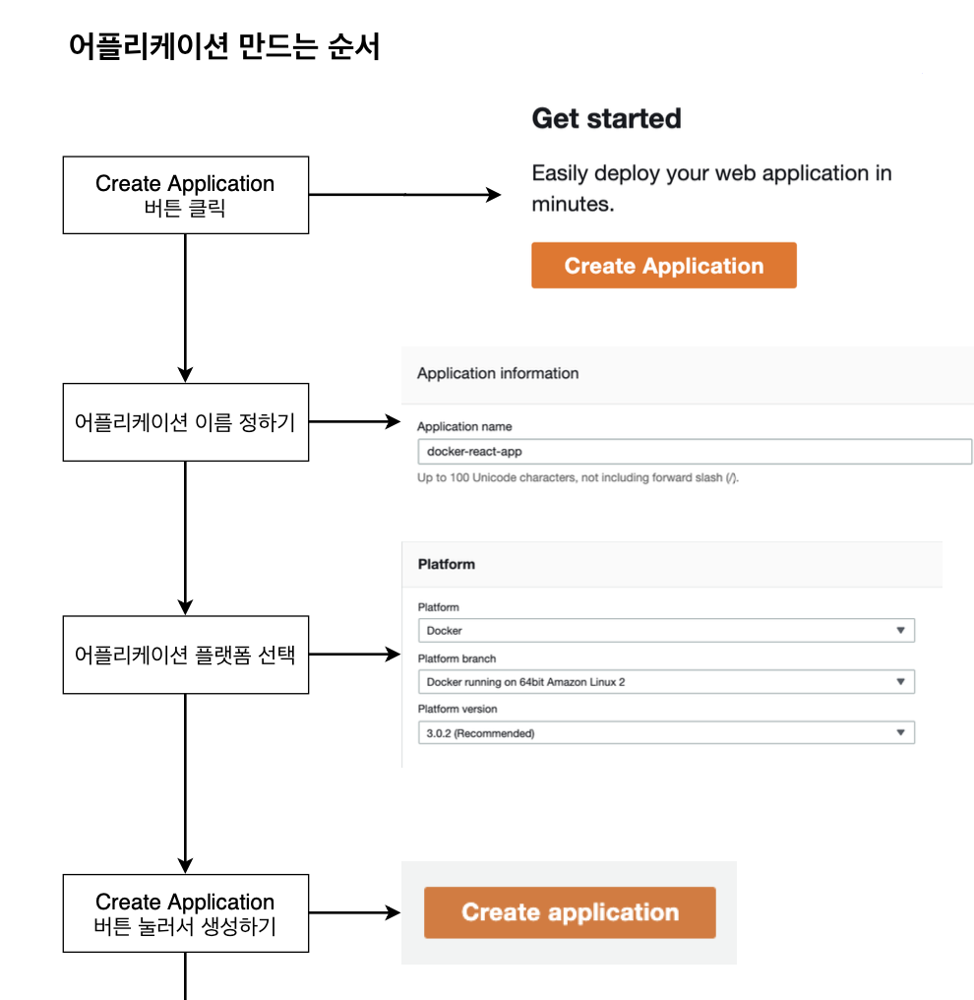
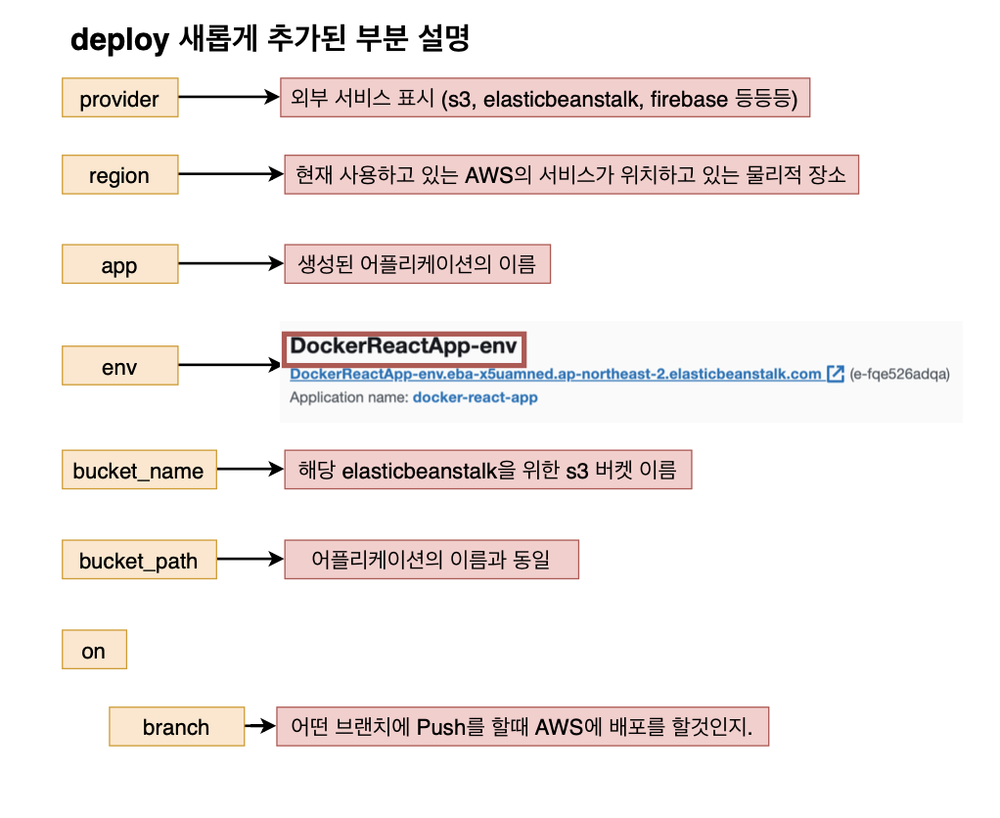

# 리액트앱 테스트 & 배포

# 1강 섹션 설명 & 깃허브에 소스 코들 올리기


테스트가 성공하면 호스팅 사이트를 통해 배포한다!


> 이렇게 소스 코드를 github에 올렸으면 이 소스가 잘 작성된 코드인지 Travis CI라는 곳에서 확인해주기 위해서 Travis CI에서 가져가줘야 합니다.

# 2강 Travis CI 설명


1. 로컬 Git에 있는 소스를 Github 저장소에 Push를 합니다.
2. Github master 저장소에 소스가 Push가 되면 Travis CI에게 소스가 PUSH 되었다고 얘기를 해줌.

3. Travis CI는 업데이트된 소스를 Github에서 가지고 옵니다.

4. 깃헙에서 가져온 소스의 테스트 코드를 실행해 봅니다.

5. 테스트 코드 실행 후 테스트가 성공하면 AWS같은 호스팅 사이트로 보내서 배포를 합니다.

# 3강 Travis CI 이용순서

깃헙에 소스를 올렸을 때 Travis CI에서 그 소스를 가져가야 하기에 깃헙과 Travis CI가 연결되어 있어야 함.
그래서 그 둘을 연결하는 순서를 먼저 알아보겠음.

#### Travsi CI 이용 순서 & 깃헙과 Travis CI 연결순서


위와 같이 잘 되었는지 확인하기!

> 지금까지 Travis CI에 가입하고 어떠한 프로젝트를 Travis CI에서 관리를 할것인지 설정함

> Travis CI로 소스를 어떻게 전달시킬것이며 전달 받은 것을 어떻게 테스트하면 그 테스트가 성공했을 때 어떻게 AWS에 전달해서 배폴르 할 것인지를 설정해주어야 함.

> 이러한 설정을 위해서는 Docker에서는 docker-compose.yml에 무엇을 할지를 작성해줬다면 Travis CI에서는 .travise.yml 파일에서 해준다.

# 4강 .travis.yml 파일 작성하기(테스트까지)

> Travis CI를 이용해서 테스트 코드를 실행하고 어플리케이션을 배포까지 해주어야 함. 그러기 위해서는 travis.yml 파일을 작성해 주어야 함.


```
sudo: required

language: generic

services:
  - docker

before_install:
  - echo "start Creating an image with dockerfile"
  - docker build -t moons94/docker-react-app -f Dockerfile.dev .

script:
  - docker run -e CI=true moons94/docker-react-app npm run test -- --coverage

after_success:
  - echo "Test Success"
```


# 5강 AWS 알아보기


EB라는 환경 안에서 각각의 것을 배포할 수 있게 된다!

# 6강 Elastic Beanstalk 환경 구성하기




> 트래픽이 많은 경우 EC2 인스턴스가 증가하여 로드 밸런서가 중재시키게 된다.

> 이것은 Elastic Beanstalk가 해주기 떄문에 이렇게 되게 된다.

# 7강 .travis.yml 파일 작성하기(배포 부분)

> 현재는 도커 이미지르 생성 후 어플을 실행하여 테스트 하는 부분까지는 travis 설정을 하였음. 이제는 테스트에 성공한 소스를 AWS Elastic Beanstalk에 자동으로 배포하는 부분을 travis 파일에 넣어줄 차례임. (deploy)

```
deploy:
  provicder: elasticbeanstalk
  region: "ap-northeast-2"
  app: "docekr-react-app"
  env:
  bucket_name: "elasticbeanstalk-ap-northeast-2-890667335767"
  bucket_path: "docker-react-app"
  on:
    branch: master
```

> 아무런 인증 없이는 Travis CI에서 마음대로 AWS에 파일을 전송할 수는 없다. 그래서 Travis CI가 AWS에 접근할 수있게 해주는 방법을 알아봄.



# 8강. Travis CI의 AWS 접근을 위한 API 생성

> 현재까지 Travis CI에서 AWS에 어떤 파일을 전해줄 거며, AWS에서 어떤 서비스를 이용할거며, 부수적인 설정들을 적어주었음. 하지만 Travis CI와 AWS가 실질적으로 소통을 할 수있게 인증하는 부분을 살펴보도록 할 예정임


인증을 위해서는 API key가 필요함. 그래서 API Key를 어떻게 받는지 알아보아야 함.


> 우선 끝났으나, 내일까지만 돌려보고 elastic 환경 종료 시키기!!
