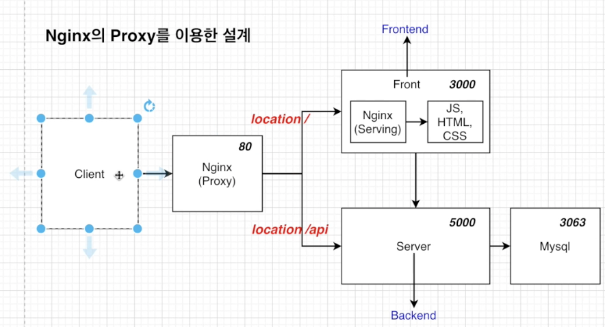
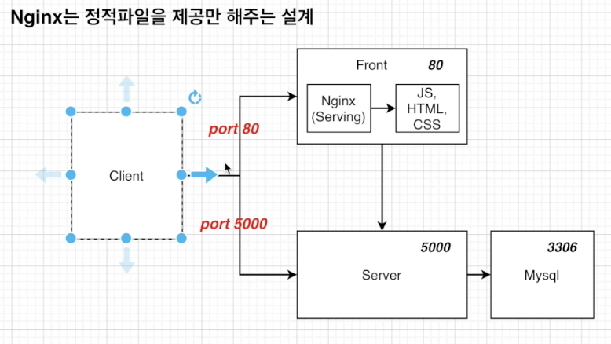
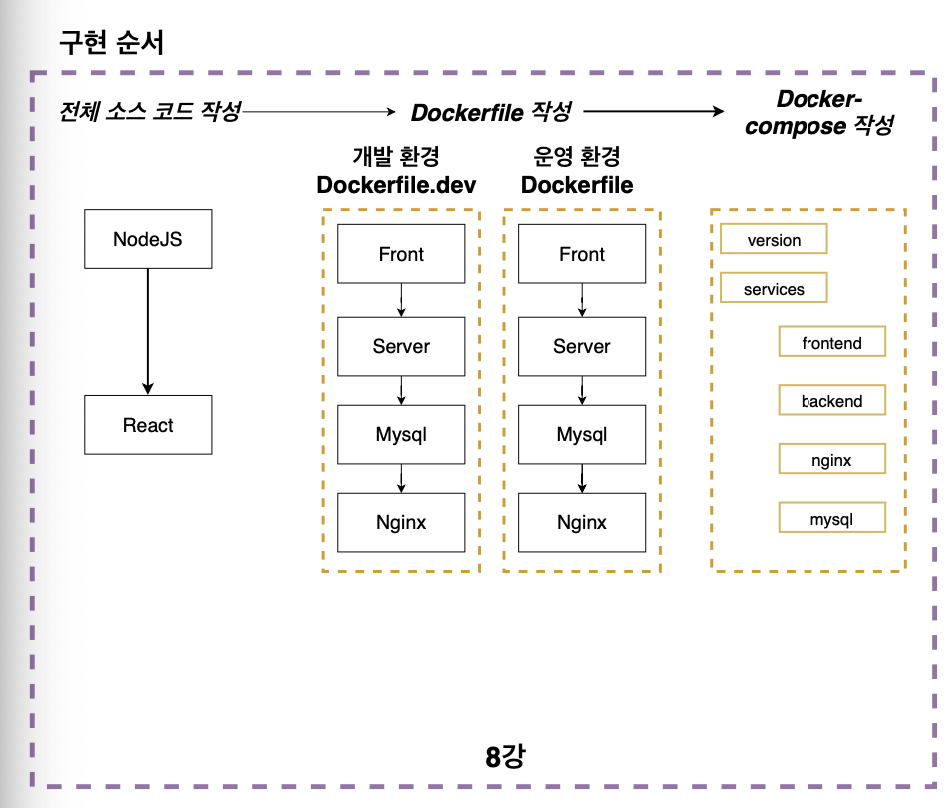
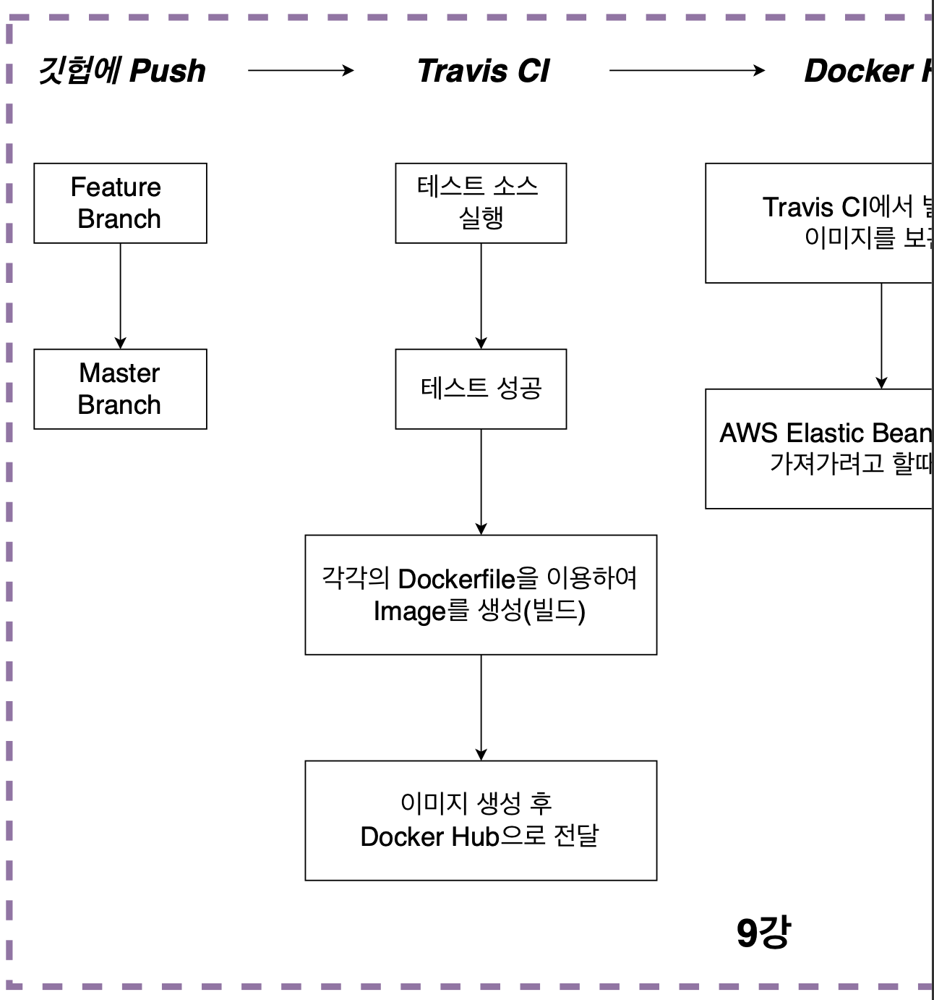
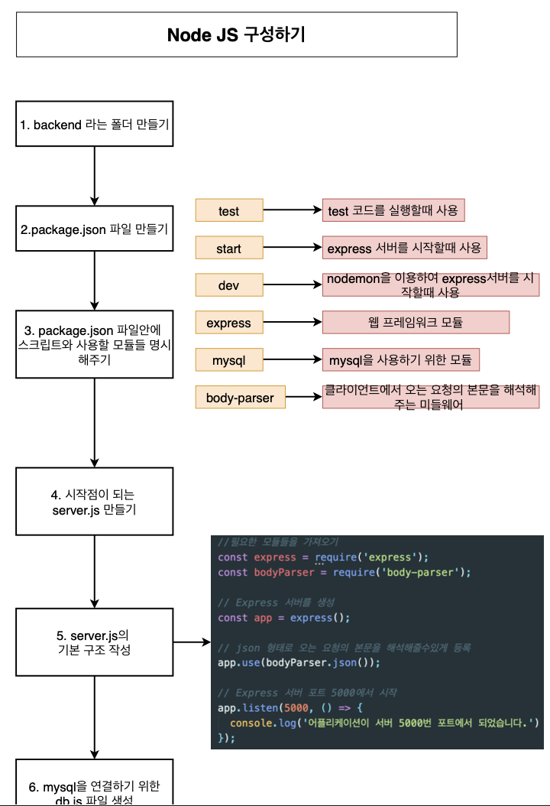
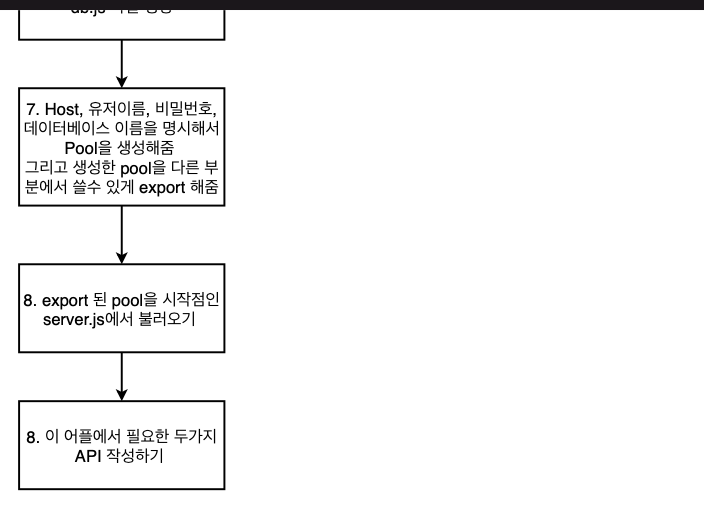
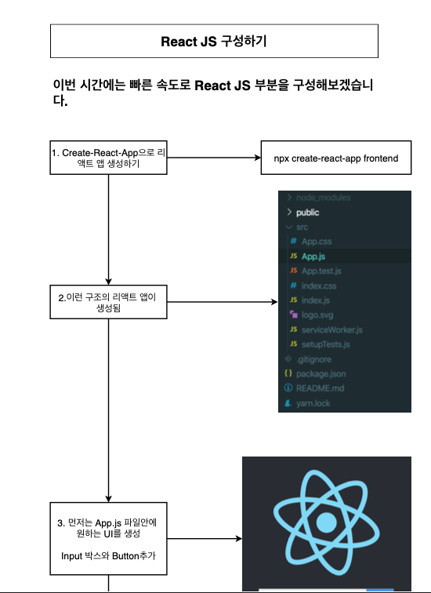
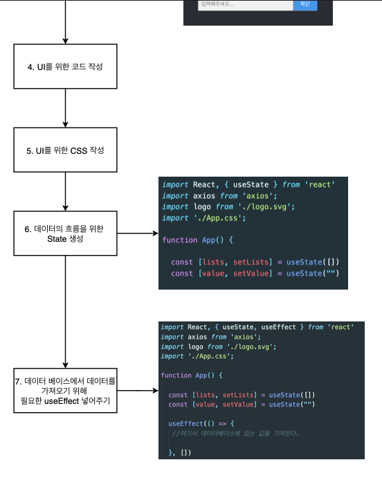
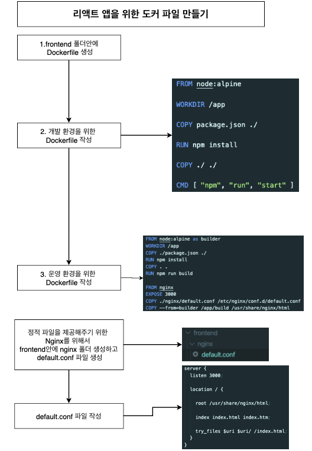

# 개발환경에서 리액트 & 노드 & 데이터베이스 앱 개발

# 1강 섹션 설명

> 6,7번 섹션에서 도커를 이용하여 리액틀 앱을 만들었음.

> 하지만 실제로 어플리케이션을 만들때는 프론트 부분만을 이용하는 것이 아닌 백엔드 서버도 필요하고 데이터 베이스 등 많은 것이 필요하기 떄문에 이번 섹션부터는 좀 더 많은 컨테이너를 사용해서 좀 더 실무에서 사용할 수 있는 어플리케이션을 만들어볼 예정

리액트 어플리케이션(single container application)

브라우저가 컨테이너 안에 있는 React JS를 연결함!

> 6~7강은 단일 컨테이너 어플리케이션을 활용해서 개발환경에서 리액트앱 개발과 리액트앱 테스트 및 배포를 실행했다면 8~9강은 멀티 컨테이너 어플리케이션을 활용해서 개발환경 리액트 & 노드 & 데이터 베이스 앱 개발과 리액트 & 노드 & 데이터 베이스 앱 테스트 & 배포를 실행함!

> 풀스택 어플리케이션의 경우 Nginx를 활용해서, React JS와 Node JS와 MySQL의 컨테이너들을 연결하게 되어 있음!!

## 현재 하는 용도

- 클라이언트에서 아무 글이나 입력을 하면 리액트를 통해서 노드로 전달된 이후 MySQL 데이터 베이스에 저장한 후 그 저장된 것을 화면에 보여주는 앱을 만듦.
  그리고 컨테이너를 재시작해도 DB에 저장된 데이터는 남이있게 해줄 것임!

### Nginx의 역할?

1. nginx의 프록시를 이용한 설계
   

기능 1 : 정적파일을 제공해주는 역할
기능 2 : 요청들을 라우팅 시켜주는 역할!

여기서 모두 이용

#### 장점

1. Request를 보낼때 URL 부분을 host 이름이 바뀌어도 변경시켜주지 않아도 됨
2. 포트가 바뀌어도 변경을 안해주어도 됨

#### 단점

nginx 설정, 전체 설계가 다소 복잡해짐

#### 형태

/api 가 들어있으면 Backend로 들어가게 되고, 아닌 경우는 Frontend로 가게 됨.

```js
axios.get(`/api/values`);
```

2. Nginx는 정적파일을 제공만 해주는 설계
   

라우팅은 하지 않고 정적파일만 제공해주는 역할

#### 장점

설계가 다소 간단하여 구현하는게 더 쉬움

#### 단점

host name이나 포트 변경이 있거나

#### 형태

포트를 보고 결정하게 됨 80이면 프론ㅌ, 5000이면 백엔드

```js
axios.get(`http://localhost:5000/api/values`);
```

### 전체 flow



1. 전체 소스 코드 작성
2. Dockerfile 작성
3. Docker-compose 작성

 4. 깃헙에 Push 5. Travis CI 6. Docker Hub 7. AWS ElasticBeanStalk

# 2강 Node js 구성하기




# 3강 React js 구성하기




# 4강 리액트 앱을 위한 도커 파일 만들기

이번 시간부터는 작성한 소스코드를 도커 환경에서 실행할수 있게 도와주는 Dockerfile을 작성해보겠음.
Dockerfile은 개발환경과 운영환경에서 다르게 구성하는게 좋기 때문에 개발환경을 위한 dockerfile을 만들고 그 후에 운영 환경을 위한 Dockerfile을 만들겠음.



# 5강 노드 앱을 위한 도커 파일 만들기

# 6강 DB에 관해서

# 7강 MYSQL을 위한 도커 파일 만들기

# 8강 NGINX를 위한 도커 파일 만들기

# 9강 Docker Compose 파일 작성하기

# 10강 Docker Volume을 이용한 데이터 베이스 데이터 유지하기
